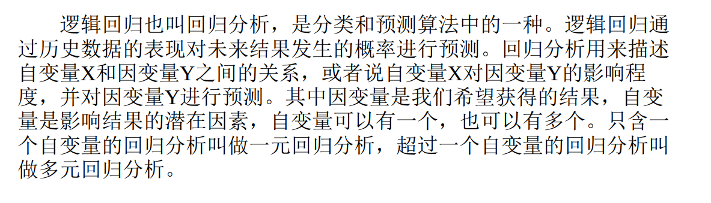
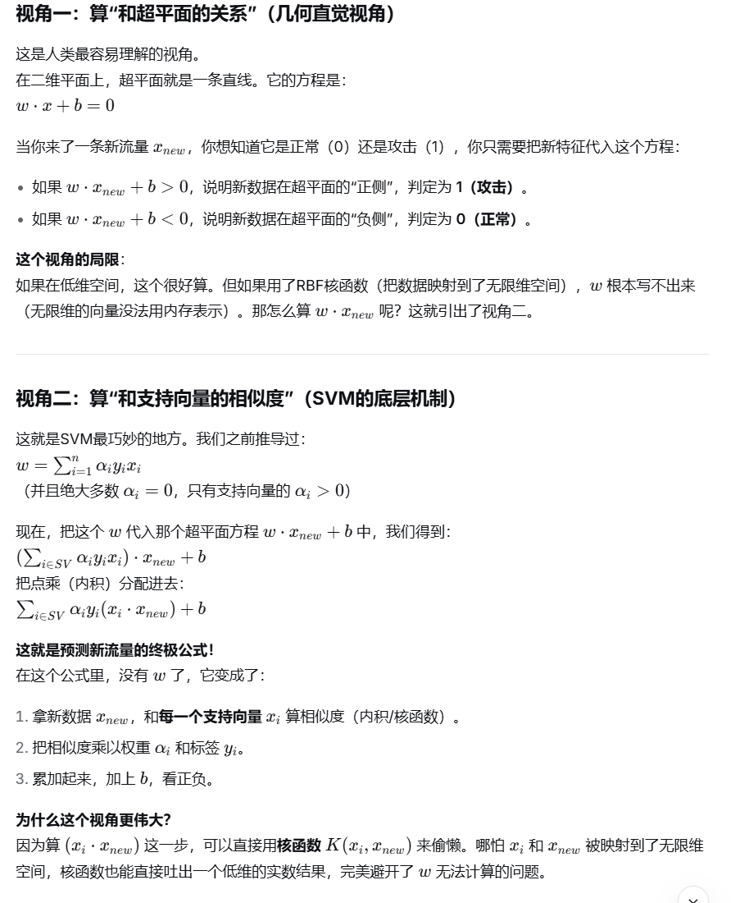
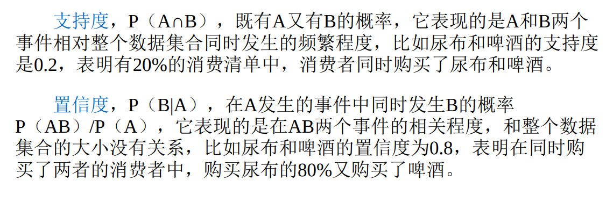
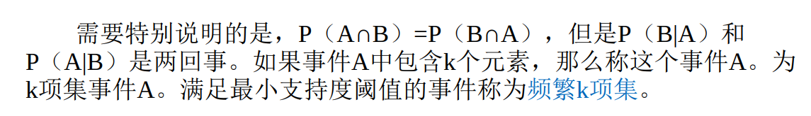
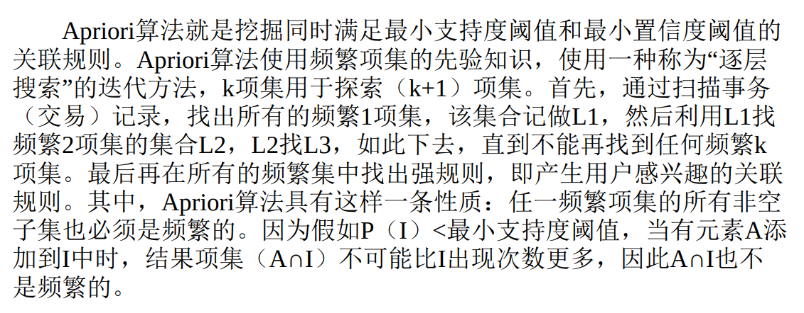
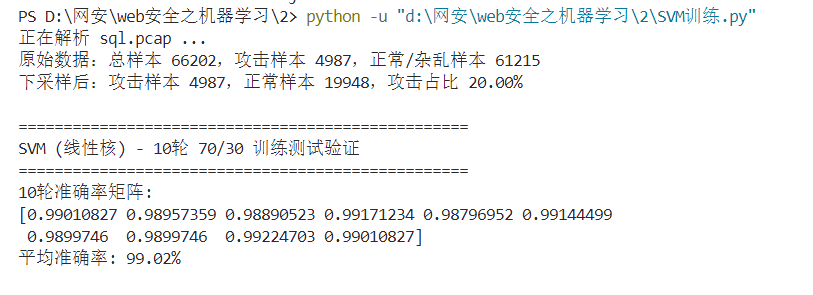

# 第二周学习报告

## 二、逻辑回归算法

**逻辑回归算法就是一个通过历史数据来构造一个函数预测下一个数据的算法，而他在机器学习中也被用来分类，本质是通过先算一个概率再通过概率来分类，而这个算概率的过程就是先根据每个特征的不同权重，来加权线性运算，对于每个数据，都会得到一个数字，再把这个数字放入Sigmoid函数里面，就会输出0-1的概率，再根据这个概率，以0.5为界区分正负**

## 三、支持向量机算法

**支持向量机算法就是有很多数据特征向量，现在想要用一个超平面，不同维数下表现形式不同，二维直线，三维平面等等，来一次性把数据二分类，而找到这个超平面的关键就在于其法向量也就是方向，这个超平面要满足在所有的数据向量都被正确分类的情况下，离两边的向量都最远，而在超平面边缘，两种向量最靠超平面的向量，它们都叫支持向量。在完成这个分类正确且距离最远的算法过程中，有一个关键变量，是向量之间的内积，用于在方向上区分向量，倾向于一边的向量方向相近而另一边与这一边的方向尽量截然不同，内积在低维很方便计算，但是如书中所说有时在当前维数找不到这样的超平面，就需要升维画超平面，而升维带来的会是内积计算量大大提升，因此，引入核函数，它省去了计算升维多出来的哪些坐标值的步骤，直接接受当前坐标，计算出升维后的内积。由此，可以得到向量相似度矩阵，再根据这个矩阵计算超平面的法向量，发现是每个向量坐标乘积加权和，而除了几个支持向量，其他向量的权都为0，也就是说，这个超平面几乎只由支持向量决定，后面来的数据，模型想要分辨，也只需要根据新向量和支持向量之间的相似度来分类就可以了，所以SVM的效率较高。另外，新数据到底是根据超平面分类还是根据支持向量分类。解答如下：**

## 四、K-Means与DBSCAN算法

**这两种算法属于无监督的聚类算法，和之前的分类算法有些不同，是不需要有标签的数据的，K-Means是随机在数据中选择k个点作为接下来聚类的几个核心，把剩下的点根据与核心的相似程度（距离），分成k个簇，再在每个簇内部计算出特征平均值，特征最接近的那个点重新变为核心点，再重复重复，直到不再有点更改簇类，就分类结束了。而DBSCAN则是基于密度聚类，首先有eps作为半径，minpts作为最小点数这两个核心参数，对于每个点的eps半径内范围如果点数大于minpts，则是核心点，如果小于，但是在核心点的范围内，则是边界点，剩余就是噪声点，聚类过程就是核心点内的核心点的点，也算作一簇，如此迭代，知道所有的点都无法再并入一簇，则剩下的噪声点就是异常行为可能的出现数据。**

## 五、Apriori与FP-growth算法

Apriori算法是基于关联规则的无监督算法，有三个基本概念

**最小支持度阈值用来筛选是不是属于干扰关联规则择出的噪音**

**最后会得到很多频繁集，再把这些频繁集去组合成规则，计算他们的置信度，大于最小置信度的就算是强关联规则。最后还需要人为判断这些关联规则意味着什么，因为它是无监督算法。**

**FP-growth算法就是由于apriori算法需要不断地去遍历数据库很多遍，在数据多的情况下效率很低，所以fp算法就是为了优化这一点产生的，它先扫一遍找一项的频繁集，再把这些频繁项降序排列根据出现次数，再把每一条数据里的它们也按顺序整理好，最后建树，一条一条记录进入树，每个特征在该节点出现次数加到节点计数上，然后找计数最小的特征节点，向上找到根节点的路径，把路径记录下来，再单独进行一次FP建树，去掉不够支持度的，如此循环再和一开始的特征组合/不组合，就得到了所有频繁集，挖过一个特征就从最开始的fp树上去掉他的节点。**

## 六、上周实践改进

**这次的实践我重新又抓了许多非sql注入的流量，然后和上一次的pcap文件合并了，并且换用SVM算法训练模型**

**关于如何从pcap中提取出特征工程所需要的带特征的数据包，pcap文件本身是由pcap文件头和数据包记录组成的，pcap文件头24个字节，后面就是连续的数据包记录，每条记录前16字节是记录头，后面是数据包原始数据流，所以python中的scapy库会按照规范来把字节记录成相应的数据包信息**

## 七、混淆矩阵

**关于混淆矩阵，它是一个以类别数为N，N*N的矩阵，横竖两轴分别代表对应类别的真实值和模型预测值，所以一个准确的模型应该得到的混淆矩阵应该大部分集中在对角线上，为什么混淆矩阵会比正常计算准确率要更加能体现模型的能力，是因为正常计算准确率是每一类正确预测的数量/所有样本的数量，而在大部分现实网络环境下，目标异常流量往往会远少于正常的流量，如果某个模型它根本没有办法识别异常流量，它就会把所有的流量标记为正常，但是由于正常流量远多于异常，所以它“蒙对”的占比非常高，导致最后的准确率异常高，混淆矩阵就没有这样的问题**